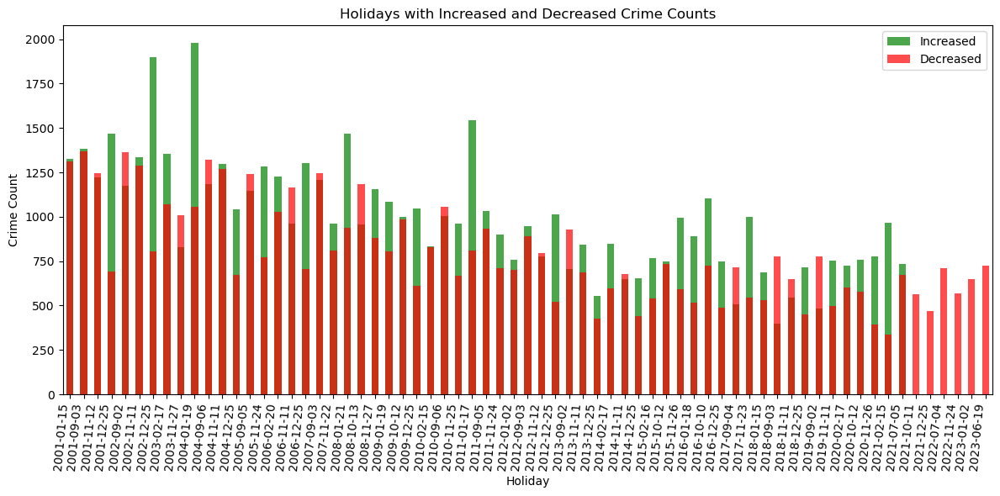

# Crime Analysis Insights

## 1. Crime Trends Over Time

- The dataset spans from 2001 to the present year (2023).
- A notable decrease in reported crimes is observed over the years.

## 2. District Comparison

- District 8 has the highest reported crime count.
- District 21 has the lowest reported crime count.

## 3. AM vs. PM Rush Hour Analysis

- PM rush hours (4 PM - 7 PM) have higher crime rates compared to AM rush hours (7 AM - 10 AM).
- Top 5 crimes during AM rush hour: Theft, Battery, Criminal Damage, Burglary, Other Offenses.
- Top 5 crimes during PM rush hour: Theft, Battery, Criminal Damage, Narcotics, Assault.
- Motor Vehicle Thefts are more common during PM rush hour.

## 4. Month-wise Crime Analysis

- July has the highest crime count.
- February has the least crime count.

## 5. Holiday Impact on Crime

- Analysis using the 'holidays' package shows varying trends during holidays.
- Increased crime counts on certain holidays may be due to gatherings and altered routines.
- Decreased crime counts on other holidays could result from increased police presence or community vigilance.

## Conclusion

This analysis provides insights into crime patterns, aiding law enforcement, policymakers, and researchers. Consideration of time, month, and holidays is crucial for effective crime prevention. Further exploration of crime types, locations, and socio-economic factors can enhance understanding and lead to targeted interventions.
